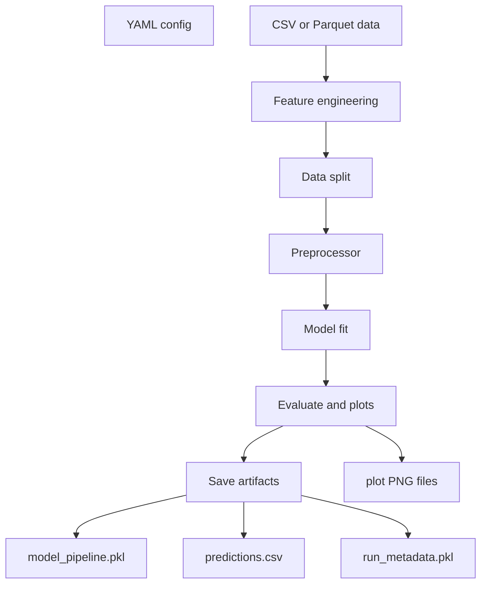
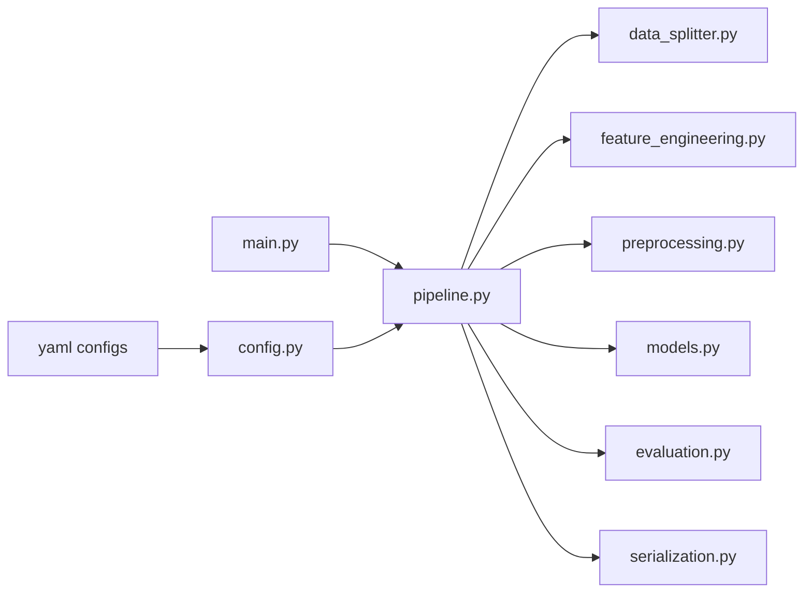
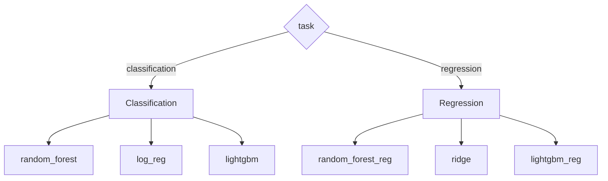
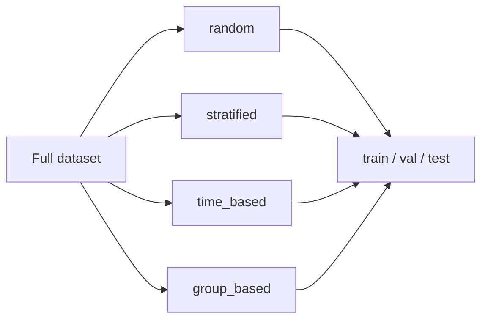
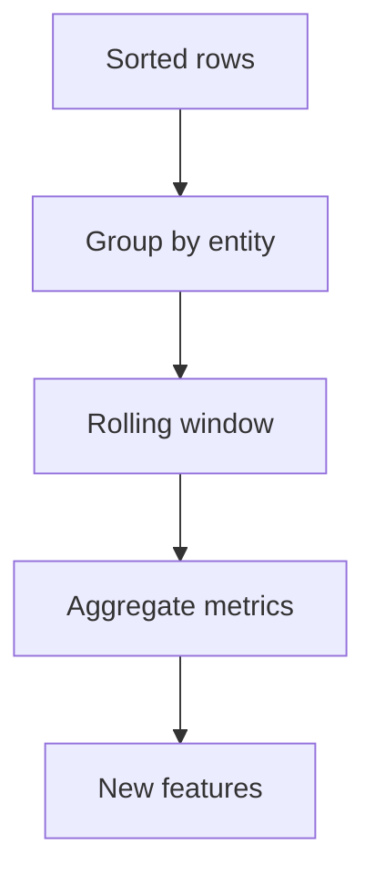
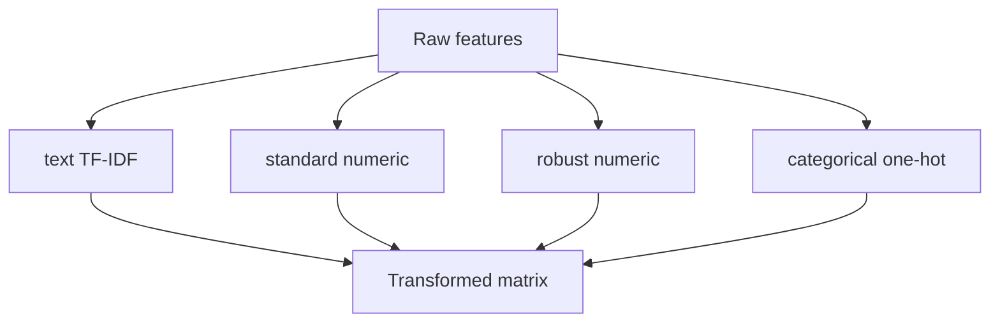
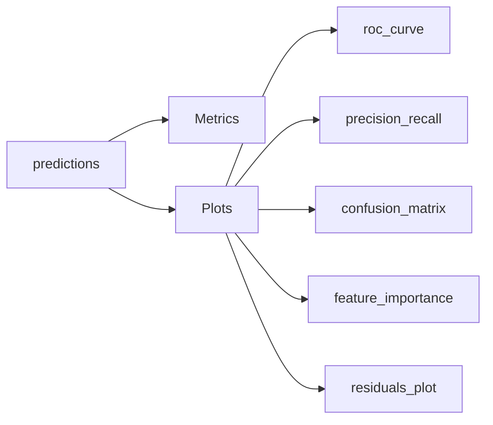

# Modular scikit-learn ML Pipeline

A YAML-driven machine learning pipeline for building, evaluating, and saving scikit-learn models. Configure data splitting, feature engineering, preprocessing, model choice, metrics, and plots in a single experiment file — no code changes required for most experiments.

**Requirements:** Python 3.9+ and the packages in `requirements.txt`.

## Pipeline overview



## Features

- **Data splitting** — random, stratified, time-based, or group-based train / val / test splits (`test_size` and `val_size` are fractions of the full dataset)
- **Feature engineering** — rolling time-window aggregations per entity; engineered columns are auto-added to preprocessing if omitted from the YAML
- **Preprocessing** — per-column-group pipelines: imputation + TF-IDF, scalers, one-hot / ordinal encoding
- **Models** — classification and regression via scikit-learn, with optional LightGBM
- **Evaluation** — configurable metrics and plots (including multiclass ROC / PR)
- **Serialization** — sklearn `Pipeline` to `.pkl`, predictions to CSV, metadata to `.pkl`

## Project structure



```
intuit/
├── main.py                      # CLI entry point
├── configs/
│   ├── sample-1.yaml            # Example config (no feature engineering)
│   ├── sample-2.yaml            # Example config (FE, text TF-IDF, time split)
│   └── iris_config.yaml         # Minimal config for Iris smoke test
├── requirements.txt
├── data/
│   ├── iris.csv                 # Downloaded via scripts/download_iris.py
│   └── sample-2.csv             # Generated via scripts/generate_sample2_data.py
├── scripts/
│   ├── download_iris.py
│   └── generate_sample2_data.py
├── .vscode/
│   └── launch.json              # Run & Debug configs (breakpoints)
├── outputs/                     # Generated artifacts (model, plots, predictions)
└── ml_pipeline/
    ├── config.py                # YAML → typed config objects
    ├── data_splitter.py         # Train / val / test splitting
    ├── feature_engineering.py   # Time-window aggregations
    ├── preprocessing.py         # ColumnTransformer builder
    ├── models.py                # Model factory
    ├── evaluation.py            # Metrics and plots
    ├── serialization.py         # Save / load .pkl artifacts
    └── pipeline.py              # MLPipeline orchestrator
```

## Installation

```bash
pip install -r requirements.txt
```

LightGBM is imported only when `algorithm` is `lightgbm` or `lightgbm_reg`. Random Forest, Logistic Regression, and Ridge work with scikit-learn alone. Parquet input requires `pyarrow` (listed in `requirements.txt`).

On macOS, if LightGBM fails to import with a `libomp.dylib` error, install OpenMP separately (not via pip):

```bash
brew install libomp
```

## Quick start (Iris dataset)

```bash
# Download Iris CSV
python3 scripts/download_iris.py

# Train, evaluate, and save artifacts
python3 main.py --config configs/iris_config.yaml --data data/iris.csv --evaluate-on test
```

You should see printed metrics (accuracy / precision / recall / F1) and artifacts under `outputs/`:

| File | Description |
|------|-------------|
| `iris_model.pkl` | Full sklearn `Pipeline` (preprocessor + model) |
| `iris_predictions.csv` | `y_true`, `y_pred`, class probabilities |
| `run_metadata.pkl` | Metrics and artifact paths |
| `plots/` | Confusion matrix, feature importance PNGs |

## Quick start (sample-2 config)

`configs/sample-2.yaml` expects transaction-style columns (`account_id`, `date_col`, `product_title`, etc.). Generate matching synthetic data, then run the full pipeline:

```bash
python3 scripts/generate_sample2_data.py
python3 main.py --config configs/sample-2.yaml --data data/sample-2.csv --evaluate-on test
```

In VS Code, use **Run and Debug** → **Run: sample-2 pipeline** (see `.vscode/launch.json`) to run with breakpoints.

## Usage in Python

```python
import pandas as pd
from ml_pipeline import MLPipeline

df = pd.read_csv("data/iris.csv")
pipeline = MLPipeline("configs/iris_config.yaml")
metrics = pipeline.fit(df, evaluate_on="test")

predictions = pipeline.predict(df)
```

`MLPipeline.predict` / `predict_proba` re-apply feature engineering from the YAML before calling the saved sklearn steps. Loading the `.pkl` alone does **not** run feature engineering — use `MLPipeline` (or apply the same FE yourself) when the config uses rolling features.

## Supported models

Set `model.algorithm` and `model.params` in YAML. Params are passed through to the underlying estimator.



### Classification (`experiment.task: classification`)

| `algorithm` | sklearn class | Notes |
|-------------|---------------|-------|
| `random_forest` | `RandomForestClassifier` | Tree-based; supports `feature_importances_` plots |
| `log_reg` | `LogisticRegression` | Linear; use sklearn params (e.g. `max_iter`, `C`) |
| `lightgbm` | `LGBMClassifier` | Requires the `lightgbm` package |

**Random Forest example:**

```yaml
model:
  algorithm: "random_forest"
  params:
    n_estimators: 100
    max_depth: 6
    random_state: 42
```

**Logistic Regression example:**

```yaml
model:
  algorithm: "log_reg"
  params:
    max_iter: 1000
    C: 1.0
    random_state: 42
```

### Regression (`experiment.task: regression`)

| `algorithm` | sklearn class |
|-------------|---------------|
| `random_forest_reg` | `RandomForestRegressor` |
| `ridge` | `Ridge` |
| `lightgbm_reg` | `LGBMRegressor` |

### Model params

All keys under `model.params` are passed through to the underlying estimator. Common tree-model params (as in `configs/sample-2.yaml`):

| Param | Type | Notes |
|-------|------|-------|
| `n_estimators` | int | Number of trees |
| `learning_rate` | float | Tree algorithms only (`lightgbm`, `random_forest`, …) |
| `max_depth` | int | Maximum tree depth |
| `num_leaves` | int | LightGBM-specific |

Use sklearn-native param names for `log_reg` and `ridge` (e.g. `max_iter`, `C`, `alpha`).

## YAML configuration reference

### Experiment

```yaml
experiment:
  task: "classification"   # classification | regression
```

### Data split

`test_size` and `val_size` are fractions of the **full** dataset in the range `(0.0, 1.0)`. With both set to `0.15`, expect roughly 70% train / 15% val / 15% test.



```yaml
data_split:
  method: "random"         # random | stratified | time_based | group_based
  target_col: "target"
  split_var: "date_col"    # required for time_based and group_based
  test_size: 0.15
  val_size: 0.15
```

### Feature engineering (optional)

Rolling aggregations per entity over a time column. Windows: `15m`, `1h`, `24h`, `7d`, `30d`, `90d`. Metrics: `count`, `sum`, `mean`, `min`, `max`, `std`.

Multi-row aggregations run in `MLPipeline` before the sklearn `ColumnTransformer` (they are not standard row-wise sklearn transformers).

If engineered columns are not listed under `preprocessing.column_groups`, they are added automatically as a `standard_scaler` numeric group.



```yaml
feature_engineering:
  entity_key: "account_id"
  timestamp_col: "date_col"
  aggregations:
    - window: "1h"
      metrics: ["count", "mean"]
      columns: ["transaction_amount"]
```

### Preprocessing

Define column groups; each group gets its own imputer + transformer pipeline.

`default_imputation` fills in `imputer` when a group omits it (`numeric` / `categorical` / `text` by transformer type).

| `default_imputation` key | Allowed values |
|------------------------|----------------|
| `numeric` | `mean`, `median`, `most_frequent`, `constant` |
| `categorical` | `most_frequent`, `constant` |
| `text` | fill value string (e.g. `""`) used when `imputer` is `constant` |

Per-group `imputer` overrides (by transformer type):

| Transformer type | Allowed `imputer` values |
|------------------|--------------------------|
| Numeric scalers (`standard_scaler`, `minmax_scaler`, `robust_scaler`) | `mean`, `median`, `constant` |
| `tfidf` | `constant` only (set `impute_value`, e.g. `""`) |
| `onehot`, `ordinal` | `most_frequent`, `constant` |

**TF-IDF:** use one text column per group, or list several columns in one group — multi-column TF-IDF groups are expanded automatically. Missing text is filled before vectorization.

TF-IDF `params` (passed to `TfidfVectorizer`):

| Param | Type | Allowed values |
|-------|------|----------------|
| `max_features` | int | Max vocabulary size |
| `ngram_range` | `[min_n, max_n]` | e.g. `[1, 2]` for unigrams + bigrams |
| `stop_words` | string or null | `"english"` or `null` (no stop words) |
| `sublinear_tf` | bool | `true` or `false` |

**One-hot / ordinal encoding** — `onehot` supports `params`:

| Param | Allowed values |
|-------|----------------|
| `drop` | `"first"`, `"if_binary"`, or `null` |



| Transformer | sklearn class |
|-------------|---------------|
| `tfidf` | `TfidfVectorizer` |
| `standard_scaler` | `StandardScaler` |
| `minmax_scaler` | `MinMaxScaler` |
| `robust_scaler` | `RobustScaler` |
| `onehot` | `OneHotEncoder` |
| `ordinal` | `OrdinalEncoder` |

```yaml
preprocessing:
  default_imputation:
    numeric: "median"
    categorical: "most_frequent"
    text: ""

  column_groups:
    - group_name: "numeric_features"
      columns: ["age", "income"]
      imputer: "median"
      transformer: "standard_scaler"
```

### Evaluation

`optimize_metric` is the primary metric reported alongside `track_metrics`. It is not used for hyperparameter search.



```yaml
evaluation:
  optimize_metric: "f1"
  track_metrics:
    - "precision"
    - "recall"
    - "roc_auc"
    - "accuracy"
  artifacts:
    plots:
      - "roc_curve"
      - "precision_recall_curve"
      - "confusion_matrix"
      - "feature_importance"
      - "residuals_plot"      # regression only
    save_model_path: "./outputs/model_pipeline.pkl"
    save_predictions_path: "./outputs/inference_results.csv"
```

**Classification metrics:** `f1`, `roc_auc`, `precision`, `recall`, `accuracy`

**Regression metrics:** `rmse`, `mae`, `r2`, `mape`

Multiclass problems (e.g. Iris) use weighted averaging for precision, recall, F1, and ROC-AUC. ROC / PR plots draw one-vs-rest curves per class.

## Saved sklearn Pipeline

The `.pkl` artifact is a sklearn `Pipeline` with steps `preprocessor` and `model`. Feature engineering (if configured) runs in `MLPipeline` before that pipeline, and is not inside the pickle.


```python
import joblib

pipeline = joblib.load("outputs/iris_model.pkl")
predictions = pipeline.predict(X_new)  # X_new must already match training columns
```

For configs with `feature_engineering`, prefer:

```python
from ml_pipeline import MLPipeline

pipe = MLPipeline("configs/sample-2.yaml")
# after fit(...):
preds = pipe.predict(new_df)
```

## Config files in this repo

| File | Purpose |
|------|---------|
| `configs/sample-2.yaml` | Full example: time split, rolling features, text TF-IDF, mixed columns, LightGBM |
| `configs/sample-1.yaml` | Same schema without feature engineering |
| `configs/iris_config.yaml` | Minimal Iris smoke test (random split, standard scaler, random forest) |

`configs/sample-1.yaml` and `configs/sample-2.yaml` expect columns such as `product_title`, `date_col`, `account_id`, etc. Use `configs/iris_config.yaml` (or adapt the YAML) when your data schema differs.

## CLI options

```bash
python3 main.py \
  --config configs/iris_config.yaml \
  --data data/iris.csv \
  --evaluate-on test    # train | val | test
```
